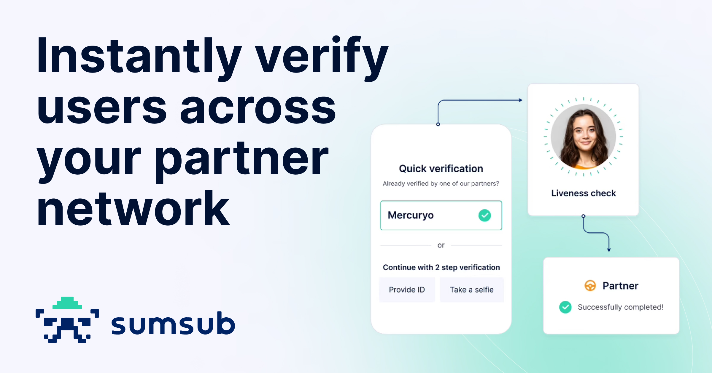

<div align="left">

[](https://sumsub.com&#x2F;)

# [Sumsub](https://sumsub.com&#x2F;)

Sumsub is the one verification platform to secure the whole user journey. With Sumsub's customizable KYC, KYB, transaction monitoring and fraud prevention solutions, you can orchestrate your verification process, welcome more customers worldwide, meet compliance requirements, reduce costs and protect your business.

Sumsub has over 2,000 clients in fintech, crypto, transportation, trading, e-commerce and gaming industries including Binance, Wirex, Avis, Bybit, Huobi, Unlimit, Flutter, Kaizen Gaming, and TransferGo.

</div>

## Requirements

Building the API client library requires:

1. Java 1.8+
2. Maven (3.8.3+)/Gradle (7.2+)

If you are adding this library to an Android Application or Library:

3. Android 8.0+ (API Level 26+)

## Installation<a id="installation"></a>
<div align="center">
  <a href="https://konfigthis.com/sdk-sign-up?company=Sumsub&language=Java">
    
  </a>
</div>

### Maven users

Add this dependency to your project's POM:

```xml
<dependency>
  <groupId>com.konfigthis</groupId>
  <artifactId>sumsub-java-sdk</artifactId>
  <version>1.0</version>
  <scope>compile</scope>
</dependency>
```

### Gradle users

Add this dependency to your `build.gradle`:

```groovy
// build.gradle
repositories {
  mavenCentral()
}

dependencies {
   implementation "com.konfigthis:sumsub-java-sdk:1.0"
}
```

### Android users

Make sure your `build.gradle` file as a `minSdk` version of at least 26:
```groovy
// build.gradle
android {
    defaultConfig {
        minSdk 26
    }
}
```

Also make sure your library or application has internet permissions in your `AndroidManifest.xml`:

```xml
<!--AndroidManifest.xml-->
<?xml version="1.0" encoding="utf-8"?>
<manifest xmlns:android="http://schemas.android.com/apk/res/android"
    xmlns:tools="http://schemas.android.com/tools">
    <uses-permission android:name="android.permission.INTERNET"/>
</manifest>
```

### Others

At first generate the JAR by executing:

```shell
mvn clean package
```

Then manually install the following JARs:

* `target/sumsub-java-sdk-1.0.jar`
* `target/lib/*.jar`

## Getting Started

Please follow the [installation](#installation) instruction and execute the following Java code:

```java
import com.konfigthis.client.ApiClient;
import com.konfigthis.client.ApiException;
import com.konfigthis.client.ApiResponse;
import com.konfigthis.client.Sumsub;
import com.konfigthis.client.Configuration;
import com.konfigthis.client.auth.*;
import com.konfigthis.client.model.*;
import com.konfigthis.client.api.AnalysisApi;
import java.util.List;
import java.util.Map;
import java.util.UUID;

public class Example {
  public static void main(String[] args) {
    Configuration configuration = new Configuration();
    configuration.host = "https://api.sumsub.com";
    
    configuration.sec0  = "YOUR API KEY";
    Sumsub client = new Sumsub(configuration);
    String currency = "currency_example"; // `BTC`, `ETH`, `BCH`, `LTC`, `USDT`, `ERC-20`, `BSV`, `XLM`, ...
    String direction = "direction_example"; // An operation type. Can be `withdrawal` or `deposit`.
    String address = "address_example"; // Target address hash.
    String txn = "txn_example"; // Transaction hash. For `withdrawals`, `txn` should not be set at all or set to `null`.
    String tokenId = "tokenId_example"; // Check the [Get available tokens](ref:get-available-tokens) method to get the full list of available currencies and token IDs.
    try {
      client
              .analysis
              .standaloneCryptoInitiation(currency, direction, address)
              .txn(txn)
              .tokenId(tokenId)
              .execute();
    } catch (ApiException e) {
      System.err.println("Exception when calling AnalysisApi#standaloneCryptoInitiation");
      System.err.println("Status code: " + e.getStatusCode());
      System.err.println("Reason: " + e.getResponseBody());
      System.err.println("Response headers: " + e.getResponseHeaders());
      e.printStackTrace();
    }

    // Use .executeWithHttpInfo() to retrieve HTTP Status Code, Headers and Request
    try {
      client
              .analysis
              .standaloneCryptoInitiation(currency, direction, address)
              .txn(txn)
              .tokenId(tokenId)
              .executeWithHttpInfo();
    } catch (ApiException e) {
      System.err.println("Exception when calling AnalysisApi#standaloneCryptoInitiation");
      System.err.println("Status code: " + e.getStatusCode());
      System.err.println("Reason: " + e.getResponseBody());
      System.err.println("Response headers: " + e.getResponseHeaders());
      e.printStackTrace();
    }
  }
}

```

## Documentation for API Endpoints

All URIs are relative to *https://api.sumsub.com*

Class | Method | HTTP request | Description
------------ | ------------- | ------------- | -------------
*AnalysisApi* | [**standaloneCryptoInitiation**](docs/AnalysisApi.md#standaloneCryptoInitiation) | **POST** /resources/standalone/crypto/cryptoSourceOfFunds | Standalone crypto analysis
*ApplicantApi* | [**addBeneficiary**](docs/ApplicantApi.md#addBeneficiary) | **POST** /resources/applicants/{applicantId}/info/companyInfo/beneficiaries | Add applicant as beneficiary
*ApplicantApi* | [**addConsentToProfile**](docs/ApplicantApi.md#addConsentToProfile) | **POST** /resources/applicants/{applicantId}/agreement | Add applicant consent
*ApplicantApi* | [**addCustomTags**](docs/ApplicantApi.md#addCustomTags) | **POST** /resources/applicants/{applicantId}/tags/add | Add custom applicant tags
*ApplicantApi* | [**addCustomTags_0**](docs/ApplicantApi.md#addCustomTags_0) | **POST** /resources/applicants/{applicantId}/tags | Add and overwrite custom applicant tags
*ApplicantApi* | [**addIdDocument**](docs/ApplicantApi.md#addIdDocument) | **POST** /resources/applicants/{applicantId}/info/idDoc | Add ID document
*ApplicantApi* | [**addImageToPaymentMethod**](docs/ApplicantApi.md#addImageToPaymentMethod) | **POST** /resources/applicantActions/{actionId}/images | Add image to payment method
*ApplicantApi* | [**addPaymentMethodInformation**](docs/ApplicantApi.md#addPaymentMethodInformation) | **POST** /resources/applicantActions/{actionId}/paymentMethod | Add payment method information
*ApplicantApi* | [**addToBlocklist**](docs/ApplicantApi.md#addToBlocklist) | **POST** /resources/applicants/{applicantId}/blacklist?note&#x3D;{note} | Add applicant to blocklist
*ApplicantApi* | [**changeCompanyData**](docs/ApplicantApi.md#changeCompanyData) | **PATCH** /resources/applicants/{applicantId}/info/companyInfo | Change company data
*ApplicantApi* | [**changeExtractedInfo**](docs/ApplicantApi.md#changeExtractedInfo) | **PATCH** /resources/applicants/{applicantId}/info | Change information extracted by Sumsub
*ApplicantApi* | [**changeRequiredDocumentSet**](docs/ApplicantApi.md#changeRequiredDocumentSet) | **POST** /resources/applicants/{applicantId}/moveToLevel | Change required document set
*ApplicantApi* | [**clarifyRejectionReason**](docs/ApplicantApi.md#clarifyRejectionReason) | **GET** /resources/moderationStates/-;applicantId&#x3D;{applicantId} | Clarify rejection reason
*ApplicantApi* | [**confirmData**](docs/ApplicantApi.md#confirmData) | **POST** /resources/applicants/{applicantId}/ekyc/confirm/{confirmationid} | Confirm applicant data
*ApplicantApi* | [**createAction**](docs/ApplicantApi.md#createAction) | **POST** /resources/applicantActions/-/forApplicant/{applicantId}?levelName&#x3D;{levelName} | Create applicant action
*ApplicantApi* | [**createCryptoSourceOfFunds**](docs/ApplicantApi.md#createCryptoSourceOfFunds) | **POST** /resources/applicantActions/-/forApplicant/{applicantId}/cryptoSourceOfFunds | Submission
*ApplicantApi* | [**createPaymentSourceActions**](docs/ApplicantApi.md#createPaymentSourceActions) | **POST** /resources/applicantActions/-/forApplicant/{applicantId}/?levelName&#x3D;paymentSource | Create payment source actions
*ApplicantApi* | [**deactivateProfile**](docs/ApplicantApi.md#deactivateProfile) | **PATCH** /resources/applicants/{applicantId}/presence/{status} | Deactivate applicant profile
*ApplicantApi* | [**enrichTransactionWithTravelRuleData**](docs/ApplicantApi.md#enrichTransactionWithTravelRuleData) | **PATCH** /resources/kyt/txns/{txnId}/data/applicant | Enriching transaction with Travel Rule
*ApplicantApi* | [**getActionOneInfo**](docs/ApplicantApi.md#getActionOneInfo) | **GET** /resources/applicantActions/{actionId}/one | Get action information
*ApplicantApi* | [**getActions**](docs/ApplicantApi.md#getActions) | **GET** /resources/applicantActions/-;applicantId&#x3D;{applicantId} | Get applicant actions
*ApplicantApi* | [**getBankCardImage**](docs/ApplicantApi.md#getBankCardImage) | **GET** /resources/applicantActions/{actionId}/images/{imageId}?preview&#x3D;{isPreview} | Get bank card image
*ApplicantApi* | [**getData**](docs/ApplicantApi.md#getData) | **GET** /resources/applicants/{applicantId}/one | Get applicant data
*ApplicantApi* | [**getDataByExternalUserId**](docs/ApplicantApi.md#getDataByExternalUserId) | **GET** /resources/applicants/-;externalUserId&#x3D;{externalUserId}/one | Get applicant data (externalUserId)
*ApplicantApi* | [**getDataLatest**](docs/ApplicantApi.md#getDataLatest) | **GET** /resources/checks/latest | Get applicant data
*ApplicantApi* | [**getFraudNetworkById**](docs/ApplicantApi.md#getFraudNetworkById) | **GET** /resources/applicantFraudNetworks/{networkId}/one | Get fraud network by ID
*ApplicantApi* | [**getFraudNetworks**](docs/ApplicantApi.md#getFraudNetworks) | **GET** /resources/applicantFraudNetworks | Get fraud networks
*ApplicantApi* | [**getFraudNetworksByApplicant**](docs/ApplicantApi.md#getFraudNetworksByApplicant) | **GET** /resources/applicantFraudNetworks/-/byApplicant/{applicantId} | Get applicant fraud networks
*ApplicantApi* | [**getLevels**](docs/ApplicantApi.md#getLevels) | **GET** /resources/applicants/-/levels | Get available applicant levels
*ApplicantApi* | [**getRequiredIdDocs**](docs/ApplicantApi.md#getRequiredIdDocs) | **POST** /resources/applicants/{applicantId}/requiredIdDocs | Get required ID documents
*ApplicantApi* | [**getReviewStatus**](docs/ApplicantApi.md#getReviewStatus) | **GET** /resources/applicants/{applicantId}/status | Get applicant review status
*ApplicantApi* | [**getVerificationStepsStatus**](docs/ApplicantApi.md#getVerificationStepsStatus) | **GET** /resources/applicants/{applicantId}/requiredIdDocsStatus | Get applicant verification steps status
*ApplicantApi* | [**getVideoCallMedia**](docs/ApplicantApi.md#getVideoCallMedia) | **GET** /resources/videoIdent/applicant/{applicantId}/media/{compositionMediaId} | Get video call media
*ApplicantApi* | [**importByArchive**](docs/ApplicantApi.md#importByArchive) | **POST** /resources/applicants/-/applicantImport | Import applicant with images by archive
*ApplicantApi* | [**importCompleted**](docs/ApplicantApi.md#importCompleted) | **POST** /resources/applicants/-/ingestCompleted?levelName&#x3D;{levelName} | Import applicants
*ApplicantApi* | [**initiateApplicantCheck**](docs/ApplicantApi.md#initiateApplicantCheck) | **POST** /resources/applicants/{applicantId}/status/pending?reason&#x3D;{reason} | Request applicant check
*ApplicantApi* | [**moveTransactionToAnotherApplicant**](docs/ApplicantApi.md#moveTransactionToAnotherApplicant) | **POST** /resources/kyt/txns/{txnId}/applicantId/{applicantId} | Move transaction to another applicant
*ApplicantApi* | [**removeCustomTags**](docs/ApplicantApi.md#removeCustomTags) | **DELETE** /resources/applicants/{applicantId}/tags | Remove custom applicant tags
*ApplicantApi* | [**removeFromBeneficiaryList**](docs/ApplicantApi.md#removeFromBeneficiaryList) | **DELETE** /resources/applicants/{applicantId}/info/companyInfo/beneficiaries/{beneficiaryApplicantId} | Remove applicant from beneficiary list
*ApplicantApi* | [**requestActionCheck**](docs/ApplicantApi.md#requestActionCheck) | **POST** /resources/applicantActions/{actionId}/review/status/pending | Request action check
*ApplicantApi* | [**resetProfile**](docs/ApplicantApi.md#resetProfile) | **POST** /resources/applicants/{applicantId}/reset | Reset applicant profile
*ApplicantApi* | [**resetVerificationStep**](docs/ApplicantApi.md#resetVerificationStep) | **POST** /resources/applicants/{applicantId}/resetStep/{idDocSetType} | Reset verification step
*ApplicantApi* | [**sandboxVerificationResponse**](docs/ApplicantApi.md#sandboxVerificationResponse) | **POST** /resources/applicants/{applicantId}/status/testCompleted | Set review for applicant in sandbox
*ApplicantApi* | [**submitDataNoDocVerification**](docs/ApplicantApi.md#submitDataNoDocVerification) | **POST** /resources/applicants/{applicantId}/ekyc/submit | Submit applicant data
*ApplicantApi* | [**submitPaymentMethod**](docs/ApplicantApi.md#submitPaymentMethod) | **POST** /resources/applicantActions/-/forApplicant/{applicantId}/paymentMethod | Submission
*ApplicantApi* | [**submitTransactionData**](docs/ApplicantApi.md#submitTransactionData) | **POST** /resources/applicants/{applicantId}/kyt/txns/-/data | Submit transaction for existing applicant
*ApplicantApi* | [**submitTransactionForNonExisting**](docs/ApplicantApi.md#submitTransactionForNonExisting) | **POST** /resources/applicants/-/kyt/txns/-/data | Submit transaction for non-existing applicant
*ApplicantApi* | [**updateFixedInfo**](docs/ApplicantApi.md#updateFixedInfo) | **PATCH** /resources/applicants/{applicantId}/fixedInfo | Change provided information
*ApplicantApi* | [**updateTopLevelInfo**](docs/ApplicantApi.md#updateTopLevelInfo) | **PATCH** /resources/applicants | Change top-level information
*AuditTrailEventApi* | [**getEvents**](docs/AuditTrailEventApi.md#getEvents) | **GET** /resources/auditTrailEvents | Audit trail events
*CheckApi* | [**additionalCompanyData**](docs/CheckApi.md#additionalCompanyData) | **GET** /resources/checks/latest?type&#x3D;COMPANY | Get additional company check data
*CheckApi* | [**additionalPoaData**](docs/CheckApi.md#additionalPoaData) | **GET** /resources/checks/latest?type&#x3D;POA | Get additional PoA data
*CheckApi* | [**emailConfirmationResults**](docs/CheckApi.md#emailConfirmationResults) | **GET** /resources/checks/latest?type&#x3D;EMAIL_CONFIRMATION | Get email confirmation check results
*CheckApi* | [**ipCheckResults**](docs/CheckApi.md#ipCheckResults) | **GET** /resources/checks/latest?type&#x3D;IP_CHECK | Get IP check results
*CheckApi* | [**performNameCrossValidation**](docs/CheckApi.md#performNameCrossValidation) | **POST** /resources/checks/crossCheck?comparisonMode&#x3D;{comparisonMode} | Perform name cross validation
*CheckApi* | [**phoneConfirmationResults**](docs/CheckApi.md#phoneConfirmationResults) | **GET** /resources/checks/latest?type&#x3D;PHONE_CONFIRMATION | Get phone confirmation check results
*CheckApi* | [**tinSsnCheckResults**](docs/CheckApi.md#tinSsnCheckResults) | **GET** /resources/checks/latest?type&#x3D;TIN | Get TIN (SSN) check results
*HealthApi* | [**statusApiGet**](docs/HealthApi.md#statusApiGet) | **GET** /resources/status/api | API health
*ImageApi* | [**getDocumentImages**](docs/ImageApi.md#getDocumentImages) | **GET** /resources/inspections/{inspectionId}/resources/{imageId} | Get document images
*ImageApi* | [**markAsInactive**](docs/ImageApi.md#markAsInactive) | **DELETE** /resources/inspections/{inspectionId}/resources/{imageId} | Mark image as inactive
*InspectionApi* | [**getVideoIdentData**](docs/InspectionApi.md#getVideoIdentData) | **GET** /resources/inspections/{inspectionId}?fields&#x3D;videoIdentData | Get video call data
*NoteApi* | [**addToTransaction**](docs/NoteApi.md#addToTransaction) | **POST** /resources/kyt/txns/notes | Add notes
*NoteApi* | [**getTransactionNotes**](docs/NoteApi.md#getTransactionNotes) | **GET** /resources/kyt/txns/{id}/notes | Get notes
*NoteApi* | [**removeFromTransaction**](docs/NoteApi.md#removeFromTransaction) | **DELETE** /resources/kyt/txns/notes | Remove notes
*NoteApi* | [**updateTransactionNotes**](docs/NoteApi.md#updateTransactionNotes) | **PATCH** /resources/kyt/txns/notes | Edit notes
*TagApi* | [**addTransactionTags**](docs/TagApi.md#addTransactionTags) | **POST** /resources/kyt/txns/{id}/tags | Add tags
*TokenApi* | [**createActionToken**](docs/TokenApi.md#createActionToken) | **POST** /resources/accessTokens | Generate access token
*TokenApi* | [**getAvailableCurrencies**](docs/TokenApi.md#getAvailableCurrencies) | **GET** /resources/standalone/crypto/availableCurrencies | Get available tokens
*TransactionApi* | [**approveReject**](docs/TransactionApi.md#approveReject) | **POST** /resources/kyt/txns/{id}/review/status/completed | Approve and reject transaction
*TransactionApi* | [**bulkImport**](docs/TransactionApi.md#bulkImport) | **POST** /resources/kyt/misc/txns/import | Bulk transaction import
*TransactionApi* | [**confirmOwnership**](docs/TransactionApi.md#confirmOwnership) | **POST** /resources/kyt/txns/{txnId}/ownership/confirmed | Confirm transaction ownership
*TransactionApi* | [**getOneData**](docs/TransactionApi.md#getOneData) | **GET** /resources/kyt/txns/-;data.txnId&#x3D;{externalTxnId}/one | Get transaction information (externalTxnId)
*TransactionApi* | [**informationOne**](docs/TransactionApi.md#informationOne) | **GET** /resources/kyt/txns/{id}/one | Get transaction information
*TransactionApi* | [**listTags**](docs/TransactionApi.md#listTags) | **GET** /resources/kyt/txns/{id}/tags | Get tags
*TransactionApi* | [**reScore**](docs/TransactionApi.md#reScore) | **POST** /resources/kyt/txns/{id}/-/score | Re-score transaction
*TransactionApi* | [**removeOwnership**](docs/TransactionApi.md#removeOwnership) | **POST** /resources/kyt/txns/{txnId}/ownership/unconfirmed | Remove transaction ownership
*TransactionApi* | [**removeTags**](docs/TransactionApi.md#removeTags) | **DELETE** /resources/kyt/txns/{id}/tags | Remove tags
*TransactionApi* | [**updateBlockchainInfo**](docs/TransactionApi.md#updateBlockchainInfo) | **PATCH** /resources/kyt/txns/{txnId}/data/info | Patch transaction with chain transaction ID
*TransactionApi* | [**updateProperties**](docs/TransactionApi.md#updateProperties) | **PATCH** /resources/kyt/txns/{id}/props | Change transaction properties
*VaspApi* | [**getAvailableVasps**](docs/VaspApi.md#getAvailableVasps) | **GET** /resources/vasps/- | Get available VASPs
*WebSdkLinkApi* | [**generateExternal**](docs/WebSdkLinkApi.md#generateExternal) | **POST** /resources/sdkIntegrations/levels/{levelName}/websdkLink | Generate external WebSDK link


## Documentation for Models

 - [AnalysisStandaloneCryptoInitiationRequest](docs/AnalysisStandaloneCryptoInitiationRequest.md)
 - [AnalysisStandaloneCryptoInitiationRequest1](docs/AnalysisStandaloneCryptoInitiationRequest1.md)
 - [ApplicantAddBeneficiaryRequest](docs/ApplicantAddBeneficiaryRequest.md)
 - [ApplicantAddBeneficiaryRequest1](docs/ApplicantAddBeneficiaryRequest1.md)
 - [ApplicantAddBeneficiaryRequestApplicant](docs/ApplicantAddBeneficiaryRequestApplicant.md)
 - [ApplicantAddConsentToProfileRequest](docs/ApplicantAddConsentToProfileRequest.md)
 - [ApplicantAddConsentToProfileRequest1](docs/ApplicantAddConsentToProfileRequest1.md)
 - [ApplicantAddConsentToProfileRequestRecordsInner](docs/ApplicantAddConsentToProfileRequestRecordsInner.md)
 - [ApplicantAddCustomTagsRequest](docs/ApplicantAddCustomTagsRequest.md)
 - [ApplicantAddCustomTagsRequest1](docs/ApplicantAddCustomTagsRequest1.md)
 - [ApplicantAddCustomTagsRequest2](docs/ApplicantAddCustomTagsRequest2.md)
 - [ApplicantAddCustomTagsRequest3](docs/ApplicantAddCustomTagsRequest3.md)
 - [ApplicantAddIdDocumentRequest](docs/ApplicantAddIdDocumentRequest.md)
 - [ApplicantAddIdDocumentRequest1](docs/ApplicantAddIdDocumentRequest1.md)
 - [ApplicantAddIdDocumentRequestMetadata](docs/ApplicantAddIdDocumentRequestMetadata.md)
 - [ApplicantAddIdDocumentResponse](docs/ApplicantAddIdDocumentResponse.md)
 - [ApplicantAddImageToPaymentMethodRequest](docs/ApplicantAddImageToPaymentMethodRequest.md)
 - [ApplicantAddImageToPaymentMethodRequest1](docs/ApplicantAddImageToPaymentMethodRequest1.md)
 - [ApplicantAddImageToPaymentMethodRequestMetadata](docs/ApplicantAddImageToPaymentMethodRequestMetadata.md)
 - [ApplicantAddPaymentMethodInformationRequest](docs/ApplicantAddPaymentMethodInformationRequest.md)
 - [ApplicantAddPaymentMethodInformationRequest1](docs/ApplicantAddPaymentMethodInformationRequest1.md)
 - [ApplicantChangeCompanyDataRequest](docs/ApplicantChangeCompanyDataRequest.md)
 - [ApplicantChangeCompanyDataRequest1](docs/ApplicantChangeCompanyDataRequest1.md)
 - [ApplicantChangeExtractedInfoRequest](docs/ApplicantChangeExtractedInfoRequest.md)
 - [ApplicantChangeExtractedInfoRequest1](docs/ApplicantChangeExtractedInfoRequest1.md)
 - [ApplicantConfirmDataRequest](docs/ApplicantConfirmDataRequest.md)
 - [ApplicantConfirmDataRequest1](docs/ApplicantConfirmDataRequest1.md)
 - [ApplicantConfirmDataRequestOauth](docs/ApplicantConfirmDataRequestOauth.md)
 - [ApplicantConfirmDataRequestOtp](docs/ApplicantConfirmDataRequestOtp.md)
 - [ApplicantCreateActionRequest](docs/ApplicantCreateActionRequest.md)
 - [ApplicantCreateActionRequest1](docs/ApplicantCreateActionRequest1.md)
 - [ApplicantCreateActionRequestPaymentMethod](docs/ApplicantCreateActionRequestPaymentMethod.md)
 - [ApplicantCreateActionRequestPaymentMethodData](docs/ApplicantCreateActionRequestPaymentMethodData.md)
 - [ApplicantCreateActionRequestPaymentMethodDataRequiredIdDoc](docs/ApplicantCreateActionRequestPaymentMethodDataRequiredIdDoc.md)
 - [ApplicantCreateCryptoSourceOfFundsRequest](docs/ApplicantCreateCryptoSourceOfFundsRequest.md)
 - [ApplicantCreateCryptoSourceOfFundsRequest1](docs/ApplicantCreateCryptoSourceOfFundsRequest1.md)
 - [ApplicantCreatePaymentSourceActionsRequest](docs/ApplicantCreatePaymentSourceActionsRequest.md)
 - [ApplicantCreatePaymentSourceActionsRequest1](docs/ApplicantCreatePaymentSourceActionsRequest1.md)
 - [ApplicantCreatePaymentSourceActionsRequestPaymentSource](docs/ApplicantCreatePaymentSourceActionsRequestPaymentSource.md)
 - [ApplicantCreatePaymentSourceActionsRequestPaymentSourceFixedInfo](docs/ApplicantCreatePaymentSourceActionsRequestPaymentSourceFixedInfo.md)
 - [ApplicantCreatePaymentSourceActionsResponse](docs/ApplicantCreatePaymentSourceActionsResponse.md)
 - [ApplicantCreatePaymentSourceActionsResponsePaymentSource](docs/ApplicantCreatePaymentSourceActionsResponsePaymentSource.md)
 - [ApplicantCreatePaymentSourceActionsResponsePaymentSourceFixedInfo](docs/ApplicantCreatePaymentSourceActionsResponsePaymentSourceFixedInfo.md)
 - [ApplicantCreatePaymentSourceActionsResponseRequiredIdDocs](docs/ApplicantCreatePaymentSourceActionsResponseRequiredIdDocs.md)
 - [ApplicantCreatePaymentSourceActionsResponseRequiredIdDocsDocSetsInner](docs/ApplicantCreatePaymentSourceActionsResponseRequiredIdDocsDocSetsInner.md)
 - [ApplicantCreatePaymentSourceActionsResponseReview](docs/ApplicantCreatePaymentSourceActionsResponseReview.md)
 - [ApplicantEnrichTransactionWithTravelRuleDataRequest](docs/ApplicantEnrichTransactionWithTravelRuleDataRequest.md)
 - [ApplicantEnrichTransactionWithTravelRuleDataRequest1](docs/ApplicantEnrichTransactionWithTravelRuleDataRequest1.md)
 - [ApplicantImportByArchiveRequest](docs/ApplicantImportByArchiveRequest.md)
 - [ApplicantImportByArchiveRequest1](docs/ApplicantImportByArchiveRequest1.md)
 - [ApplicantImportCompletedRequest](docs/ApplicantImportCompletedRequest.md)
 - [ApplicantImportCompletedRequest1](docs/ApplicantImportCompletedRequest1.md)
 - [ApplicantImportCompletedRequestInfo](docs/ApplicantImportCompletedRequestInfo.md)
 - [ApplicantImportCompletedRequestInfoAddressesInner](docs/ApplicantImportCompletedRequestInfoAddressesInner.md)
 - [ApplicantImportCompletedRequestReview](docs/ApplicantImportCompletedRequestReview.md)
 - [ApplicantImportCompletedRequestReviewReview](docs/ApplicantImportCompletedRequestReviewReview.md)
 - [ApplicantRemoveCustomTagsRequest](docs/ApplicantRemoveCustomTagsRequest.md)
 - [ApplicantRemoveCustomTagsRequest1](docs/ApplicantRemoveCustomTagsRequest1.md)
 - [ApplicantSandboxVerificationResponseRequest](docs/ApplicantSandboxVerificationResponseRequest.md)
 - [ApplicantSandboxVerificationResponseRequest1](docs/ApplicantSandboxVerificationResponseRequest1.md)
 - [ApplicantSubmitDataNoDocVerificationRequest](docs/ApplicantSubmitDataNoDocVerificationRequest.md)
 - [ApplicantSubmitDataNoDocVerificationRequest1](docs/ApplicantSubmitDataNoDocVerificationRequest1.md)
 - [ApplicantSubmitDataNoDocVerificationRequestInfo](docs/ApplicantSubmitDataNoDocVerificationRequestInfo.md)
 - [ApplicantSubmitTransactionDataRequest](docs/ApplicantSubmitTransactionDataRequest.md)
 - [ApplicantSubmitTransactionDataRequest1](docs/ApplicantSubmitTransactionDataRequest1.md)
 - [ApplicantSubmitTransactionDataRequest1Applicant](docs/ApplicantSubmitTransactionDataRequest1Applicant.md)
 - [ApplicantSubmitTransactionDataRequest1Counterparty](docs/ApplicantSubmitTransactionDataRequest1Counterparty.md)
 - [ApplicantSubmitTransactionDataRequest1Props](docs/ApplicantSubmitTransactionDataRequest1Props.md)
 - [ApplicantSubmitTransactionDataRequestApplicant](docs/ApplicantSubmitTransactionDataRequestApplicant.md)
 - [ApplicantSubmitTransactionDataRequestApplicantAddress](docs/ApplicantSubmitTransactionDataRequestApplicantAddress.md)
 - [ApplicantSubmitTransactionDataRequestApplicantDevice](docs/ApplicantSubmitTransactionDataRequestApplicantDevice.md)
 - [ApplicantSubmitTransactionDataRequestApplicantDeviceAddress](docs/ApplicantSubmitTransactionDataRequestApplicantDeviceAddress.md)
 - [ApplicantSubmitTransactionDataRequestApplicantDeviceCoords](docs/ApplicantSubmitTransactionDataRequestApplicantDeviceCoords.md)
 - [ApplicantSubmitTransactionDataRequestApplicantDeviceIpInfo](docs/ApplicantSubmitTransactionDataRequestApplicantDeviceIpInfo.md)
 - [ApplicantSubmitTransactionDataRequestApplicantIdDocsInner](docs/ApplicantSubmitTransactionDataRequestApplicantIdDocsInner.md)
 - [ApplicantSubmitTransactionDataRequestApplicantInstitutionInfo](docs/ApplicantSubmitTransactionDataRequestApplicantInstitutionInfo.md)
 - [ApplicantSubmitTransactionDataRequestApplicantInstitutionInfoAddress](docs/ApplicantSubmitTransactionDataRequestApplicantInstitutionInfoAddress.md)
 - [ApplicantSubmitTransactionDataRequestApplicantPaymentMethod](docs/ApplicantSubmitTransactionDataRequestApplicantPaymentMethod.md)
 - [ApplicantSubmitTransactionDataRequestCounterparty](docs/ApplicantSubmitTransactionDataRequestCounterparty.md)
 - [ApplicantSubmitTransactionDataRequestInfo](docs/ApplicantSubmitTransactionDataRequestInfo.md)
 - [ApplicantSubmitTransactionDataRequestProps](docs/ApplicantSubmitTransactionDataRequestProps.md)
 - [ApplicantSubmitTransactionForNonExistingRequest](docs/ApplicantSubmitTransactionForNonExistingRequest.md)
 - [ApplicantSubmitTransactionForNonExistingRequest1](docs/ApplicantSubmitTransactionForNonExistingRequest1.md)
 - [ApplicantSubmitTransactionForNonExistingRequest1Applicant](docs/ApplicantSubmitTransactionForNonExistingRequest1Applicant.md)
 - [ApplicantSubmitTransactionForNonExistingRequest1Counterparty](docs/ApplicantSubmitTransactionForNonExistingRequest1Counterparty.md)
 - [ApplicantSubmitTransactionForNonExistingRequestApplicant](docs/ApplicantSubmitTransactionForNonExistingRequestApplicant.md)
 - [ApplicantSubmitTransactionForNonExistingRequestCounterparty](docs/ApplicantSubmitTransactionForNonExistingRequestCounterparty.md)
 - [ApplicantUpdateFixedInfoRequest](docs/ApplicantUpdateFixedInfoRequest.md)
 - [ApplicantUpdateFixedInfoRequest1](docs/ApplicantUpdateFixedInfoRequest1.md)
 - [ApplicantUpdateTopLevelInfoRequest](docs/ApplicantUpdateTopLevelInfoRequest.md)
 - [ApplicantUpdateTopLevelInfoRequest1](docs/ApplicantUpdateTopLevelInfoRequest1.md)
 - [CheckPerformNameCrossValidationRequest](docs/CheckPerformNameCrossValidationRequest.md)
 - [CheckPerformNameCrossValidationRequest1](docs/CheckPerformNameCrossValidationRequest1.md)
 - [CheckPerformNameCrossValidationRequestIdDocsInner](docs/CheckPerformNameCrossValidationRequestIdDocsInner.md)
 - [NoteAddToTransactionRequest](docs/NoteAddToTransactionRequest.md)
 - [NoteAddToTransactionRequest1](docs/NoteAddToTransactionRequest1.md)
 - [NoteRemoveFromTransactionRequest](docs/NoteRemoveFromTransactionRequest.md)
 - [NoteRemoveFromTransactionRequest1](docs/NoteRemoveFromTransactionRequest1.md)
 - [NoteUpdateTransactionNotesRequest](docs/NoteUpdateTransactionNotesRequest.md)
 - [NoteUpdateTransactionNotesRequest1](docs/NoteUpdateTransactionNotesRequest1.md)
 - [TagAddTransactionTagsRequest](docs/TagAddTransactionTagsRequest.md)
 - [TagAddTransactionTagsRequest1](docs/TagAddTransactionTagsRequest1.md)
 - [TransactionApproveRejectRequest](docs/TransactionApproveRejectRequest.md)
 - [TransactionApproveRejectRequest1](docs/TransactionApproveRejectRequest1.md)
 - [TransactionBulkImportRequest](docs/TransactionBulkImportRequest.md)
 - [TransactionBulkImportRequest1](docs/TransactionBulkImportRequest1.md)
 - [TransactionBulkImportRequest1Data](docs/TransactionBulkImportRequest1Data.md)
 - [TransactionBulkImportRequest1DataApplicant](docs/TransactionBulkImportRequest1DataApplicant.md)
 - [TransactionBulkImportRequest1DataCounterparty](docs/TransactionBulkImportRequest1DataCounterparty.md)
 - [TransactionBulkImportRequestData](docs/TransactionBulkImportRequestData.md)
 - [TransactionBulkImportRequestDataApplicant](docs/TransactionBulkImportRequestDataApplicant.md)
 - [TransactionBulkImportRequestDataCounterparty](docs/TransactionBulkImportRequestDataCounterparty.md)
 - [TransactionBulkImportRequestDataInfo](docs/TransactionBulkImportRequestDataInfo.md)
 - [TransactionRemoveTagsRequest](docs/TransactionRemoveTagsRequest.md)
 - [TransactionRemoveTagsRequest1](docs/TransactionRemoveTagsRequest1.md)
 - [TransactionUpdateBlockchainInfoRequest](docs/TransactionUpdateBlockchainInfoRequest.md)
 - [TransactionUpdateBlockchainInfoRequest1](docs/TransactionUpdateBlockchainInfoRequest1.md)
 - [TransactionUpdatePropertiesRequest](docs/TransactionUpdatePropertiesRequest.md)
 - [TransactionUpdatePropertiesRequest1](docs/TransactionUpdatePropertiesRequest1.md)


## Author
This Java package is automatically generated by [Konfig](https://konfigthis.com)
